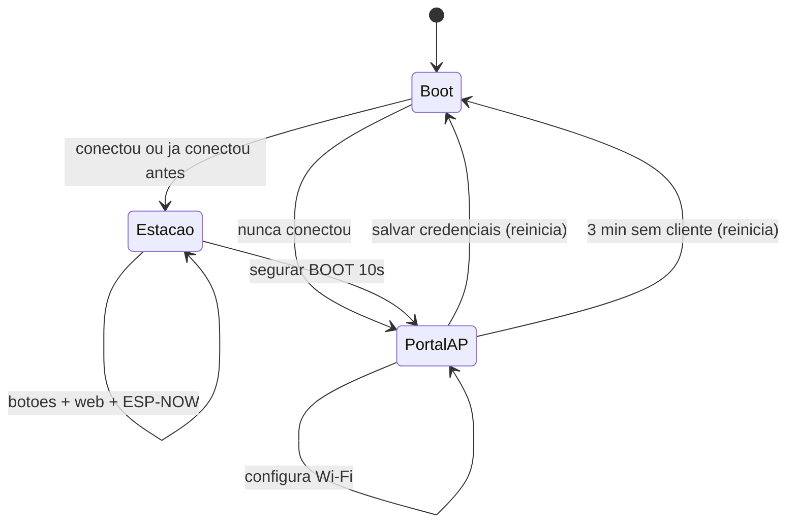
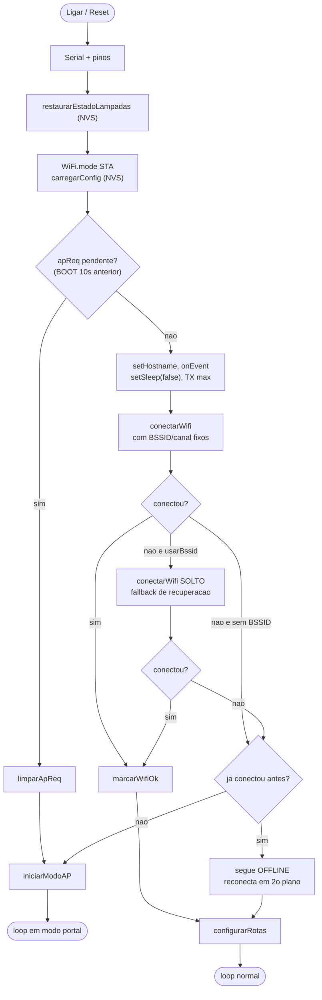
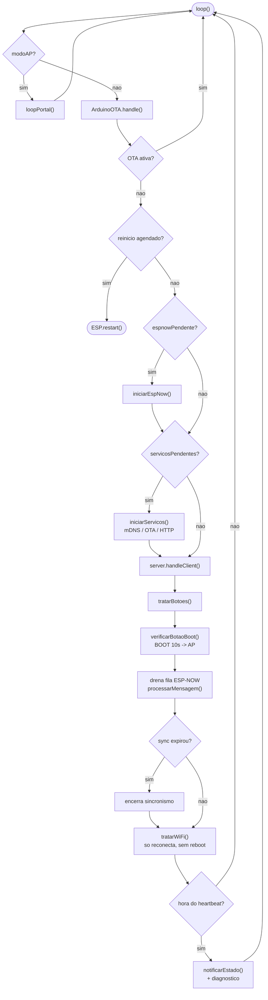
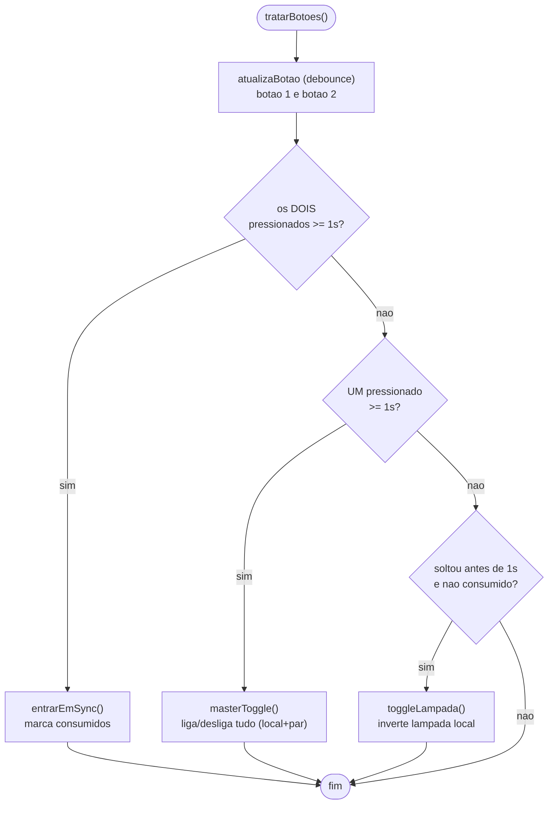
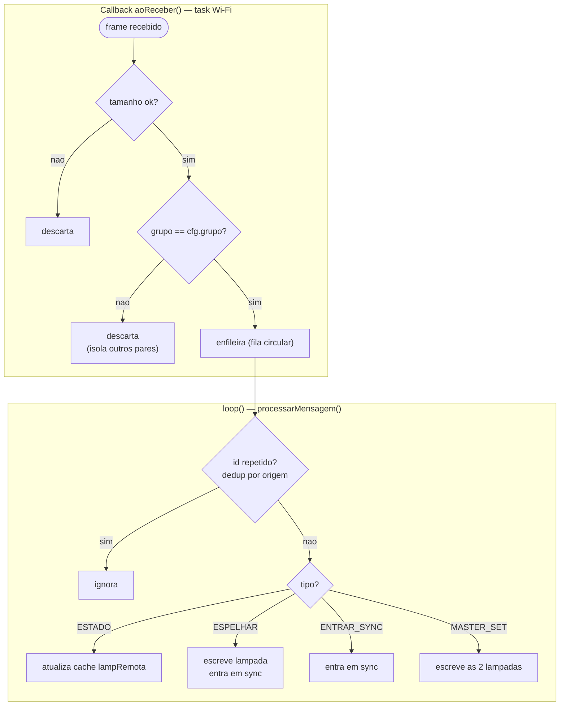
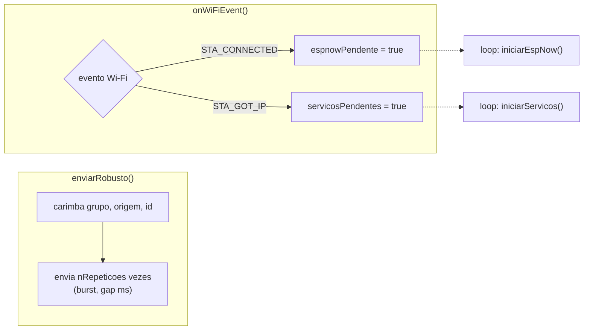
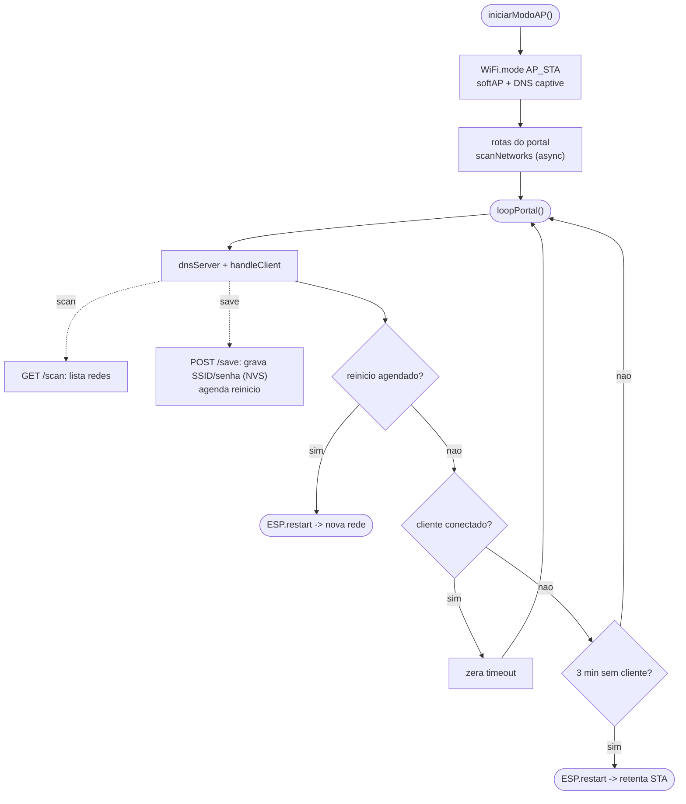
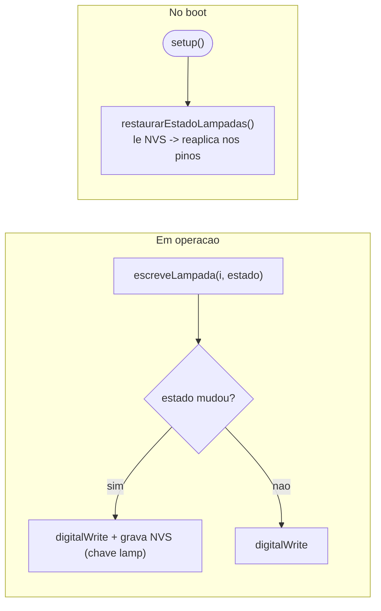
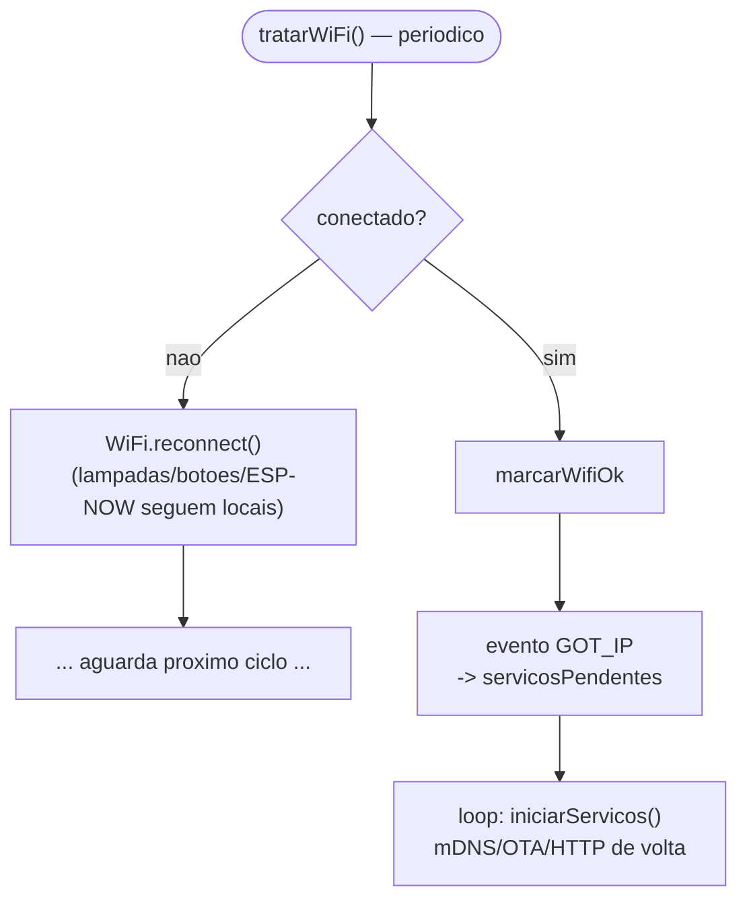

# Fluxograma do Sistema — Interruptor Inteligente ESP32

Diagramas do firmware (`main.cpp`), do boot ao regime permanente. Renderizam no
GitHub e no VS Code (extensão Markdown Preview Mermaid). Legenda das formas:
**oval** = início/fim · **retângulo** = ação · **losango** = decisão · **cilindro** = NVS.

---

## 1. Visão geral (modos de operação)

O sistema tem dois modos: **Estação** (operação normal) e **Portal AP** (configuração
de Wi-Fi). O boot decide para qual ir.

---

## 2. Boot / `setup()`

Restaura as lâmpadas **antes** de qualquer rede, carrega a config do NVS e decide entre
operar como estação ou abrir o portal — com o **fallback** que ignora o BSSID/canal fixos
quando eles apontam para um AP inválido.

---

## 3. Loop principal (modo estação)

Laço cooperativo: OTA, subida de serviços sinalizada pelos eventos de Wi-Fi, HTTP, botões,
BOOT, drenagem da fila ESP-NOW, expiração do sincronismo, reconexão e heartbeat.

---

## 4. Botões e gestos (`tratarBotoes()`)

Uma leitura com debounce alimenta a decisão entre toque curto, pressão longa de um botão e
pressão longa dos dois. Flags de "consumido" impedem dois disparos no mesmo gesto.

---

## 5. ESP-NOW — recepção

O callback (contexto da task Wi-Fi) só filtra por **grupo** e enfileira; o `loop()` deduplica
e aplica o efeito. Separar callback (leve) de processamento (no loop) evita trabalho pesado
no contexto da pilha Wi-Fi.

---

## 6. ESP-NOW — envio e eventos de Wi-Fi

Envio em rajada (idempotente + dedup) e os eventos de Wi-Fi que apenas levantam flags — o
trabalho pesado de (re)subir serviços roda no loop.

---

## 7. Portal de configuração Wi-Fi (`loopPortal()`)

SoftAP + DNS captive servindo só a página de configuração. Sai por salvamento de
credenciais ou por timeout sem cliente (auto-recuperação).

---

## 8. Persistência do estado das lâmpadas

Grava no NVS só quando muda; restaura no boot. É o que impede um reinício (energia, OTA,
Wi-Fi) de apagar as luzes.

---

## 9. Reconexão de Wi-Fi (sem reboot)

Um interruptor precisa funcionar offline: a queda de Wi-Fi **não** reinicia nem apaga as
luzes; apenas tenta reconectar, e os serviços de rede voltam sozinhos no evento `GOT_IP`.

